<div align="center">

# Airport API

Backend REST API for airport operations, flight scheduling, seat booking and order lifecycle management.

<p>
  
  
  
  
</p>

<p>
  
  
  
  
  
  
</p>

</div>

---

## Contents

<div align="center">

<table>
<tr>
<td width="48%" valign="top">

<b>Project</b>

- [About the project](#about-the-project)
- [Key features](#key-features)
- [Technology stack](#technology-stack)
- [Project architecture](#project-architecture)
- [Database models](#database-models)
- [Custom business logic](#custom-business-logic)
- [Authentication and permissions](#authentication-and-permissions)
- [Error handling](#error-handling)

</td>
<td width="48%" valign="top">

<b>Run, explore and verify</b>

- [Local setup](#local-setup)
- [Demo data](#demo-data)
- [Docker](#docker)
- [Run the published Docker image](#run-the-published-docker-image)
- [API reference](#api-reference)
- [OpenAPI documentation](#openapi-documentation)
- [Testing](#testing)
- [Code quality](#code-quality)
- [Development workflow](#development-workflow)
- [Author](#author)

</td>
</tr>
</table>

</div>

---

# About the project

Airport API is a Django REST Framework project that models a realistic airport booking workflow.

The project is intentionally built as more than a CRUD exercise. Reference entities can be managed by staff users, flights can be scheduled with airplane and crew availability checks, passengers can create booking orders with nested tickets, and cancellations propagate through related domain objects.

<table>
<tr>
<th>Area</th>
<th>What is implemented</th>
</tr>
<tr>
<td><b>Reference data</b></td>
<td>Countries, cities, airports, airplane types, airplanes and crew</td>
</tr>
<tr>
<td><b>Flight operations</b></td>
<td>Routes, schedules, crew assignment, airplane assignment, statuses, availability</td>
</tr>
<tr>
<td><b>Booking</b></td>
<td>Orders, nested tickets, seat validation, purchase restrictions, cancellation</td>
</tr>
<tr>
<td><b>Reporting</b></td>
<td>Airport statistics, popular routes, seat availability, calculated flight state</td>
</tr>
<tr>
<td><b>Infrastructure</b></td>
<td>PostgreSQL, Docker, uv, OpenAPI documentation, tests and coverage</td>
</tr>
</table>

---

# Key features

<table>
<tr>
<th>Feature</th>
<th>Implementation</th>
</tr>
<tr>
<td>Authentication</td>
<td>Email-based custom user model and JWT access/refresh tokens</td>
</tr>
<tr>
<td>Permissions</td>
<td>Public read access for reference data; staff-only writes; user-scoped orders</td>
</tr>
<tr>
<td>Filtering</td>
<td><code>django-filter</code> with UUID, text, datetime, range, boolean and custom filters</td>
</tr>
<tr>
<td>Pagination</td>
<td>Paginated list responses with deterministic queryset ordering</td>
</tr>
<tr>
<td>Images</td>
<td>Airport images, airplane images and crew photos</td>
</tr>
<tr>
<td>Flight scheduling</td>
<td>Airplane and crew conflict validation with a required 30-minute buffer</td>
</tr>
<tr>
<td>Booking</td>
<td>Nested ticket creation through orders with atomic database transactions</td>
</tr>
<tr>
<td>Seat safety</td>
<td>Status-aware conditional unique constraint for active tickets</td>
</tr>
<tr>
<td>Cancellations</td>
<td>Dedicated flight and order cancellation actions with cascading status updates</td>
</tr>
<tr>
<td>Statistics</td>
<td>Airport operational statistics and popular route ranking</td>
</tr>
<tr>
<td>Documentation</td>
<td>OpenAPI schema, Swagger UI and ReDoc</td>
</tr>
<tr>
<td>Testing</td>
<td>Model, validator, serializer, view and authentication test suites</td>
</tr>
</table>

---

# Technology stack

<table>
<tr>
<th>Technology</th>
<th>Purpose</th>
</tr>
<tr>
<td>Python 3.14</td>
<td>Programming language</td>
</tr>
<tr>
<td>Django 6</td>
<td>ORM, models, administration, settings and management commands</td>
</tr>
<tr>
<td>Django REST Framework</td>
<td>REST API, serializers, permissions and ViewSets</td>
</tr>
<tr>
<td>PostgreSQL 17</td>
<td>Relational database</td>
</tr>
<tr>
<td>Simple JWT</td>
<td>JWT authentication</td>
</tr>
<tr>
<td>django-filter</td>
<td>Filtering and custom filter methods</td>
</tr>
<tr>
<td>drf-spectacular</td>
<td>OpenAPI schema, Swagger and ReDoc</td>
</tr>
<tr>
<td>Pillow</td>
<td>Image validation and uploads</td>
</tr>
<tr>
<td>python-decouple</td>
<td>Environment variable loading</td>
</tr>
<tr>
<td>uv</td>
<td>Dependency management and virtual environments</td>
</tr>
<tr>
<td>Docker / Compose</td>
<td>Application and PostgreSQL containers</td>
</tr>
<tr>
<td>coverage.py</td>
<td>Coverage measurement and HTML reports</td>
</tr>
<tr>
<td>Flake8 / Black</td>
<td>Static analysis and formatting</td>
</tr>
</table>

<details>
<summary><b>Dependency groups</b></summary>

The runtime dependencies are declared under `[project].dependencies`.

Development-only tools are declared under:

```toml
[dependency-groups]
dev = [
    "black",
    "coverage",
    "django-debug-toolbar",
    "django-stubs",
    "flake8",
    "pytest",
]
```

This keeps application packages and development tooling explicitly separated.

</details>

---

# Project architecture

```text
airport-api/
│
├── airport/
│   ├── fixtures/
│   │   └── airport_service_data_fixture.json
│   ├── management/
│   │   └── commands/
│   │       ├── generate_airport_fixture.py
│   │       └── wait_for_db.py
│   ├── migrations/
│   ├── schema/
│   ├── tests/
│   │   ├── admin/
│   │   ├── models/
│   │   ├── serializers/
│   │   ├── validation/
│   │   ├── views/
│   │   └── base.py
│   ├── utils/
│   │   ├── files.py
│   │   └── validators.py
│   ├── admin.py
│   ├── admin_filters.py
│   ├── filters.py
│   ├── models.py
│   ├── permissions.py
│   ├── serializers.py
│   ├── urls.py
│   └── views.py
│
├── airport_service/
│   ├── exceptions.py
│   ├── settings.py
│   └── urls.py
│
├── user/
│   ├── tests/
│   │   └── test_admin.py
│   ├── admin.py
│   ├── managers.py
│   ├── models.py
│   ├── serializers.py
│   ├── urls.py
│   └── views.py
│
├── docs/
│   ├── database-diagram.png
│   └── screenshots/
│
├── .coveragerc
├── .dockerignore
├── .env.example
├── Dockerfile
├── docker-compose.yaml
├── manage.py
├── pyproject.toml
├── pytest.ini
├── uv.lock
└── README.md
```

The codebase is split by responsibility rather than by endpoint. Domain rules live in
validators and models, API representation lives in serializers, endpoint behavior
lives in views, and repeatable test setup is shared through `airport/tests/base.py`.
The admin layer is tested separately because it contains project-specific display,
queryset and lifecycle behavior.

## ORM strategy

The API uses ORM optimization deliberately.

| Technique | Used for |
|---|---|
| `select_related()` | Foreign-key chains such as route → airport → city → country |
| `prefetch_related()` | Crew and ticket relations |
| `Prefetch()` | Loading only active tickets for flight detail |
| `annotate()` | Available seats, ticket counts and statistics |
| Conditional `Count()` | Active/cancelled ticket statistics |
| Stable `order_by()` | Deterministic paginated responses |

Example:

```python
Flight.objects.select_related(
    "route__source__closest_big_city__country",
    "route__destination__closest_big_city__country",
    "airplane__airplane_type",
).prefetch_related("crew")
```

---

# Database models

## Model overview

<div align="center">

<table>
<tr>
<th>Model</th>
<th>Purpose</th>
<th>Important rules</th>
</tr>
<tr>
<td><code>User</code></td>
<td>Authentication and order ownership</td>
<td>Email is used instead of username</td>
</tr>
<tr>
<td><code>Country</code></td>
<td>Country reference data</td>
<td>Unique name</td>
</tr>
<tr>
<td><code>City</code></td>
<td>City inside a country</td>
<td>Unique <code>(name, country)</code></td>
</tr>
<tr>
<td><code>Airport</code></td>
<td>Airport connected to its closest major city</td>
<td>Unique name</td>
</tr>
<tr>
<td><code>AirplaneType</code></td>
<td>Aircraft model/type</td>
<td>Unique name</td>
</tr>
<tr>
<td><code>Airplane</code></td>
<td>Physical aircraft</td>
<td><code>rows >= 1</code>, <code>seats_in_row >= 1</code></td>
</tr>
<tr>
<td><code>Crew</code></td>
<td>Flight crew member</td>
<td>Many-to-many assignment to flights</td>
</tr>
<tr>
<td><code>Route</code></td>
<td>Directional airport connection</td>
<td>Source differs from destination; unique source/destination pair</td>
</tr>
<tr>
<td><code>Flight</code></td>
<td>Scheduled operational flight</td>
<td>Valid times, crew presence and schedule availability</td>
</tr>
<tr>
<td><code>Order</code></td>
<td>User booking</td>
<td>Created for the authenticated user and contains nested tickets</td>
</tr>
<tr>
<td><code>Ticket</code></td>
<td>Reserved seat</td>
<td>Only one active ticket may reserve a seat on a flight</td>
</tr>
</table>

</div>

### How the domain fits together

The models form three connected layers.

<table align="center">
<tr>
<th>Reference layer</th>
<th>Operational layer</th>
<th>Booking layer</th>
</tr>
<tr>
<td valign="top">
<code>Country</code><br>
&nbsp;&nbsp;↓<br>
<code>City</code><br>
&nbsp;&nbsp;↓<br>
<code>Airport</code><br><br>
<code>AirplaneType</code><br>
&nbsp;&nbsp;↓<br>
<code>Airplane</code><br><br>
<code>Crew</code>
</td>
<td valign="top">
<code>Airport</code><br>
&nbsp;&nbsp;↓<br>
<code>Route</code><br>
&nbsp;&nbsp;↓<br>
<code>Flight</code><br><br>
Flight combines a route, airplane, crew members and schedule.
</td>
<td valign="top">
<code>User</code><br>
&nbsp;&nbsp;↓<br>
<code>Order</code><br>
&nbsp;&nbsp;↓<br>
<code>Ticket</code><br>
&nbsp;&nbsp;↓<br>
<code>Flight</code><br><br>
A ticket reserves a concrete row and seat on a flight.
</td>
</tr>
</table>

This separation is useful because reference objects describe *what exists*,
flights describe *what is scheduled*, and orders/tickets describe *what users
have booked*. Most of the custom logic exists at the boundaries between these
layers: assigning a physical airplane to a flight, assigning crew to a time
interval, and reserving a seat on that flight.

## Database diagram

<p align="center">
  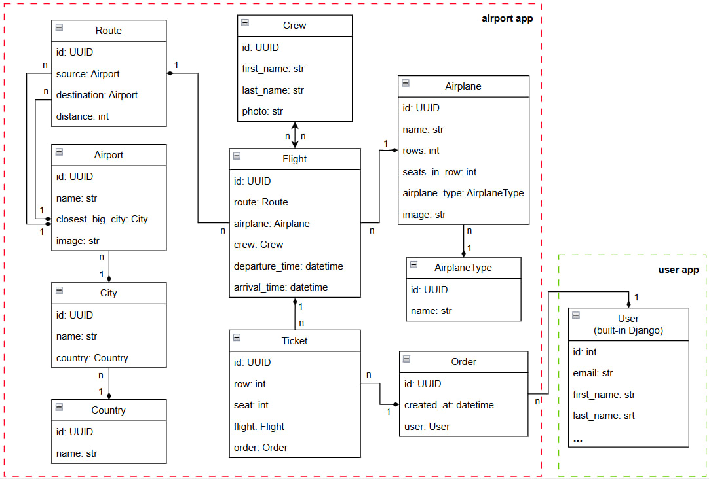
</p>

## Flight status and current state

A flight has two related but intentionally different concepts:

<table align="center">
<tr>
<th>Concept</th>
<th>Stored in database?</th>
<th>Purpose</th>
</tr>
<tr>
<td><code>status</code></td>
<td>Yes</td>
<td>Represents an explicit business decision made by the system or staff</td>
</tr>
<tr>
<td><code>current_state</code></td>
<td>No</td>
<td>Represents what is happening to the flight right now based on time and stored status</td>
</tr>
</table>

### Stored `status`

| Status | Meaning |
|---|---|
| `scheduled` | The flight remains a normal active flight in the database. It has not been explicitly delayed or cancelled. |
| `delayed` | Staff explicitly marked the active flight as delayed. |
| `cancelled` | Staff cancelled the flight through the dedicated cancellation workflow. |

A flight does **not** automatically rewrite its database `status` when time
passes. For example, after a normal scheduled flight arrives, its stored status
may still be:

```text
scheduled
```

That is expected. `scheduled` answers:

> "Was this flight explicitly delayed or cancelled?"

It does not answer:

> "Where is the flight in its timeline right now?"

### Calculated `current_state`

`current_state` answers the second question.

| `current_state` | Condition |
|---|---|
| `scheduled` | Stored status is `scheduled` and departure is still in the future |
| `delayed` | Stored status is `delayed` and departure is still in the future |
| `departed` | Flight has departed but has not reached arrival time |
| `arrived` | Current time is at or after arrival time |
| `cancelled` | Stored status is `cancelled` |

Example:

```text
Database:
status = scheduled
departure_time = 10:00
arrival_time = 12:00

At 09:00 -> current_state = scheduled
At 11:00 -> current_state = departed
At 13:00 -> current_state = arrived

Stored status remains scheduled.
```

This design avoids unnecessary background writes simply to turn a historical
flight into `arrived`. The current operational state can always be derived from
time, while explicit business decisions such as `delayed` and `cancelled`
remain persisted.

## Order statuses

| Status | Meaning |
|---|---|
| `confirmed` | Active booking |
| `cancelled` | Booking has been cancelled |

## Ticket statuses

| Status | Meaning | Reserves a seat? |
|---|---|---:|
| `active` | Current valid reservation | Yes |
| `cancelled` | Historical ticket after cancellation | No |

The database uniqueness rule applies to the seat only while the ticket is
`active`. A cancelled ticket therefore keeps booking history but releases the
seat for a future booking request.

---

# Custom business logic

This section explains the non-CRUD logic that was intentionally added to model real booking behavior.

## Business rules at a glance

| Rule | Why it exists |
|---|---|
| Arrival must be after departure | Prevent impossible flight intervals |
| At least one crew member is required | Prevent crew-less flights |
| Airplane cannot overlap another flight | Prevent double-booking aircraft |
| Crew cannot overlap another flight | Prevent double-booking crew |
| 30-minute flight buffer | Allow realistic turnaround time |
| Cancelled flights do not block schedules | Cancelled resources are free again |
| Airplane cannot change after active tickets | Preserve booked seat layout |
| Flight cannot be cancelled by ordinary PATCH | Force lifecycle changes through one action |
| Tickets cannot be bought after departure | Prevent invalid late bookings |
| Tickets cannot be bought for cancelled flights | Keep booking state consistent |
| One order contains one flight | Keep a booking operation internally consistent |
| Maximum tickets per order | Configurable business limit |
| Duplicate seats in one request are rejected | Catch request-level duplicates early |
| Active seat uniqueness is also enforced in DB | Protect against concurrent bookings |
| Order creation is atomic | Prevent partial bookings |
| Flight cancellation is atomic | Prevent partially cancelled state |
| Order cancellation is atomic | Keep order/ticket states synchronized |

## Flight scheduling

The scheduling validator checks a protected interval around an existing flight:

```text
|---- 30 min ----|===== existing flight =====|---- 30 min ----|
```

A second flight using the same airplane or crew member may not enter that interval.

Cancelled flights are excluded from conflict checks.

When updating a flight, the current flight is excluded from the query so it does not conflict with itself.

## Airplane change protection

An aircraft may have a different seat layout.

Changing:

```text
30 rows × 6 seats
```

to:

```text
20 rows × 4 seats
```

after tickets were sold could invalidate existing seat coordinates.

For this reason, the airplane cannot be changed while active tickets already exist.

## Safe seat booking

Seat safety is enforced at two levels.

| Layer | Responsibility |
|---|---|
| Serializer/business validation | Friendly error before attempting the write |
| Database conditional unique constraint | Final protection against concurrent requests |

If two requests race for the same active seat, the database remains the source of truth. A late `IntegrityError` is converted into a normal serializer validation error.

## Cancellation workflows

### Flight cancellation

Flight cancellation is performed through:

```http
POST /api/airport/flights/{id}/cancel/
```

The operation validates whether cancellation is allowed and then updates the
flight, its active tickets and related confirmed orders inside one
`transaction.atomic()` block. This prevents a partially cancelled state.

### Order cancellation

Order cancellation is performed through:

```http
POST /api/airport/orders/{id}/cancel/
```

When cancellation is allowed, the order and its tickets are changed together
inside one transaction so their statuses cannot become inconsistent.

---

# Authentication and permissions

## Authentication endpoints

| Method | Endpoint | Access | Purpose |
|---|---|---|---|
| `POST` | `/api/user/register/` | Public | Create account |
| `POST` | `/api/user/token/` | Public | Obtain access + refresh tokens |
| `POST` | `/api/user/token/refresh/` | Public | Refresh access token |
| `POST` | `/api/user/token/verify/` | Public | Verify token |
| `GET` | `/api/user/me/` | Authenticated | Retrieve current user |
| `PUT` | `/api/user/me/` | Authenticated | Full user update |
| `PATCH` | `/api/user/me/` | Authenticated | Partial user update |

JWT header:

```http
Authorization: Bearer <access-token>
```

## Permissions matrix

| Resource | Anonymous | Authenticated user | Staff |
|---|---:|---:|---:|
| Countries | Read | Read | Full CRUD |
| Cities | Read | Read | Full CRUD |
| Airports | Read | Read | Full CRUD |
| Airplane types | Read | Read | Full CRUD |
| Airplanes | Read | Read | Full CRUD |
| Crew | Read | Read | Full CRUD |
| Routes | Read | Read | Full CRUD |
| Flights | Read | Read | Full CRUD |
| Orders | No access | Own orders | All orders |
| Airport image upload | No | No | Yes |
| Airplane image upload | No | No | Yes |
| Crew photo upload | No | No | Yes |
| Flight cancellation | No | No | Yes |
| Order cancellation | No | Own order | Any visible order |

A regular user does not receive all orders and then filter them in Python. The queryset itself is restricted to:

```python
queryset.filter(user=request.user)
```

Therefore another user's order is not visible and returns `404 Not Found`.

---

# Error handling

The API uses Django REST Framework validation and exception responses together
with project business validators and database constraints.

The general section below describes the common HTTP contract. Exact business
errors are documented next to the corresponding resource in the API reference,
where the request that causes the error is easier to understand.

## Common HTTP responses

| Status | Meaning in this project |
|---|---|
| `200 OK` | Successful retrieve, update or custom action |
| `201 Created` | Resource was created successfully |
| `204 No Content` | Resource was deleted successfully |
| `400 Bad Request` | Invalid request data or a violated business rule |
| `401 Unauthorized` | Authentication credentials are missing or invalid |
| `403 Forbidden` | Authenticated user does not have permission |
| `404 Not Found` | Object does not exist or is outside the current user's queryset |
| `405 Method Not Allowed` | The endpoint intentionally does not expose this method |
| `429 Too Many Requests` | Configured throttling limit was exceeded |

## Custom exception handler

The project-level handler is located in:

```text
airport_service/exceptions.py
```

and is registered in DRF settings:

```python
REST_FRAMEWORK = {
    "EXCEPTION_HANDLER": (
        "airport_service.exceptions.custom_exception_handler"
    ),
}
```

The handler was added for one concrete project-level case: Django can raise
`ProtectedError` when a staff user tries to delete a reference object that is
still used by related records.

For example, a country may still be referenced by cities, a city by airports, or
another protected reference object by operational data. Without a custom API
handler, that database-level exception is not a useful client-facing message.

The project converts it into a normal API response:

```python
def custom_exception_handler(
    exc: Exception,
    context: dict[str, Any],
) -> Response | None:
    if isinstance(exc, ProtectedError):
        return Response(
            {
                "detail": (
                    "This object cannot be deleted because "
                    "it is used by other records."
                ),
            },
            status=400,
        )

    return exception_handler(exc, context)
```

So the purpose is **not to bypass or weaken `PROTECT`**. The protected relation
still prevents deletion exactly as intended. The custom handler only translates
the low-level exception into a predictable and understandable API response.

```text
DELETE protected object
        |
        v
Django detects related protected records
        |
        v
ProtectedError
        |
        v
custom_exception_handler
        |
        v
400 Bad Request

{
  "detail": "This object cannot be deleted because it is used by other records."
}
```

All other exceptions are passed back to DRF's standard `exception_handler`, so
normal DRF validation, authentication, permission and not-found behavior remains
unchanged.

Business-specific database errors are still handled where their exact meaning is
known. For example, during order creation an `IntegrityError` can mean that
another request reserved one of the selected seats at the same time. The order
serializer catches that case and returns a ticket validation message instead of
exposing a raw PostgreSQL error.

## Why an inaccessible order returns `404`

This behavior is about **order ownership**, not about the order being absent from
the database.

For a regular authenticated passenger, `OrderViewSet` restricts the queryset
before object lookup:

```python
Order.objects.filter(user=request.user)
```

Suppose two users exist:

```text
User A owns Order #1
User B owns Order #2
```

If User A requests User B's order:

```http
GET /api/airport/orders/<user-b-order-id>/
```

that order is not present in User A's allowed queryset. DRF therefore cannot
retrieve it and returns:

```http
404 Not Found
```

The API intentionally does not return `403 Forbidden` here because doing so
would reveal that an order with that UUID exists but belongs to somebody else.
With queryset-level ownership filtering, both an unknown order ID and another
user's order are simply unavailable to the current passenger.

Staff users are different: their queryset is not restricted to one owner, so
they can retrieve orders from all users.


---

# Local setup

This is the first way to run the project: Django and PostgreSQL run directly on
your machine. The project uses `uv` for Python/dependency management and
`python-decouple` for environment configuration.

## 1. Clone the repository

```bash
git clone https://github.com/otakuc0der/airport-api.git
cd airport-api
```

## 2. Install `uv`

Check whether it is available:

```bash
uv --version
```

Windows:

```powershell
winget install --id Astral-sh.uv
```

Linux/macOS:

```bash
curl -LsSf https://astral.sh/uv/install.sh | sh
```

## 3. Create the virtual environment and install dependencies

Create the project virtual environment and install the locked dependencies:

```bash
uv sync
```

`uv` reads `pyproject.toml` and `uv.lock`, creates the project virtual
environment in `.venv` if it does not already exist, and synchronizes the
installed dependencies with the locked versions.

The project requires:

```text
Python >= 3.14
```

### Virtual environment

After running `uv sync`, the project virtual environment is available in:

```text
.venv/
```

Activating it manually is optional because the commands in this documentation
use `uv run`, which automatically executes them inside the project's virtual
environment.

For example:

```bash
uv run python manage.py migrate
uv run python manage.py runserver
```

If you prefer to activate the virtual environment manually, use:

Windows PowerShell:

```powershell
.venv\Scripts\Activate.ps1
```

Windows Command Prompt:

```cmd
.venv\Scripts\activate.bat
```

Linux/macOS:

```bash
source .venv/bin/activate
```

After activation, commands can be executed directly without `uv run`:

```bash
python manage.py migrate
python manage.py runserver
```

To leave the virtual environment:

```bash
deactivate
```

The examples below use `uv run`, so manual activation is not required.

## 4. Create `.env`

Create the local environment file from the provided example.

Windows PowerShell:

```powershell
Copy-Item .env.example .env
```

Linux/macOS:

```bash
cp .env.example .env
```

The real `.env` file contains environment-specific configuration and must not be
committed to Git.

## Environment variables

The `.env.example` file contains all variables required to run the project
locally or with Docker Compose.

```env
SECRET_KEY=your-secret-key
DEBUG=True

FIXTURE_PASSWORD=your-fixture-password
MAX_TICKETS_PER_ORDER=5

POSTGRES_HOST=localhost
POSTGRES_PORT=5432
POSTGRES_USER=your-postgres-user
POSTGRES_PASSWORD=your-postgres-password
POSTGRES_DB=your-postgres-db
PGDATA=/var/lib/postgresql/data

APP_IMAGE=otakucoder/airport-api:latest
```

| Variable | Example / type | Purpose |
|---|---|---|
| `SECRET_KEY` | string | Django cryptographic secret key |
| `DEBUG` | `True` / `False` | Enables or disables Django debug mode |
| `FIXTURE_PASSWORD` | string | Password assigned to generated demo users |
| `MAX_TICKETS_PER_ORDER` | integer | Maximum number of tickets allowed in a single order |
| `POSTGRES_HOST` | `localhost` | PostgreSQL host for running Django directly on the host machine |
| `POSTGRES_PORT` | `5432` | PostgreSQL port used by Django |
| `POSTGRES_USER` | string | PostgreSQL user |
| `POSTGRES_PASSWORD` | string | PostgreSQL password |
| `POSTGRES_DB` | string | PostgreSQL database name |
| `PGDATA` | filesystem path | PostgreSQL data directory used by the Docker database container |
| `APP_IMAGE` | Docker image | Application image used by Docker Compose |

### PostgreSQL host

When Django is started directly on the host machine, it connects to PostgreSQL
using the values from `.env`:

```text
localhost:5432
```

When the project is started with Docker Compose, the application container must
connect to the PostgreSQL container through the Compose network. Therefore,
`docker-compose.yaml` overrides `POSTGRES_HOST`:

```yaml
environment:
  POSTGRES_HOST: db
```

The application still connects to PostgreSQL on its internal port `5432`.

The Compose port mapping:

```yaml
ports:
  - "25432:5432"
```

exposes PostgreSQL as `localhost:25432` on the host machine. This mapping is only
needed when accessing the containerized PostgreSQL database directly from the
host.

### Application Docker image

Docker Compose uses the application image specified by `APP_IMAGE`:

```env
APP_IMAGE=otakucoder/airport-api:latest
```

By default, this points to the latest published Airport API image on Docker Hub.

To use a specific release instead, change it to:

```env
APP_IMAGE=otakucoder/airport-api:1.0.0
```

When building the application locally with Docker Compose, the same image name
can also be used for the locally built image.

## 5. Apply migrations

Make sure PostgreSQL is running and the database configured in `.env` exists.

```bash
uv run python manage.py migrate
```

## 6. Generate and load demo data

Generate a fresh fixture:

```bash
uv run python manage.py generate_airport_fixture
```

The generated file is written to:

```text
airport/fixtures/airport_service_data_fixture.json
```

Load it into the currently configured database:

```bash
uv run python manage.py loaddata airport_service_data_fixture
```

Generation and loading are intentionally separate: generation creates a reusable
JSON fixture, while `loaddata` inserts those objects into the selected database.

## 7. Start Django

```bash
uv run python manage.py runserver
```

Useful local addresses:

| Service | Address |
|---|---|
| API server | `http://127.0.0.1:8000/` |
| Django Admin | `http://127.0.0.1:8000/admin/` |
| Swagger UI | `http://127.0.0.1:8000/api/docs/` |
| ReDoc | `http://127.0.0.1:8000/api/docs/redoc/` |
| OpenAPI schema | `http://127.0.0.1:8000/api/doc/` |

---

# Demo data

The fixture is intended to turn a fresh database into a useful demonstration
environment without manually creating dozens of related records.

It includes representative:

- countries and cities;
- airports;
- airplane types and airplanes;
- crew members;
- routes;
- flights with different statuses;
- users;
- orders;
- active and cancelled tickets.

The generated records follow the same booking constraints used by the API.

## Where demo data is loaded

The exact commands are kept next to the execution mode that uses them:

- [Local setup](#6-generate-and-load-demo-data) for a locally running Django process;
- [Docker](#4-generate-and-load-demo-data-in-docker) for the containerized application.

This avoids mixing commands for different databases or execution environments.

## Demo account roles

The fixture contains multiple roles because Django distinguishes **staff access**
from **superuser privileges**, and the API also uses the staff flag for protected
write operations.

<div align="center">

<table>
<tr>
<th>Role</th>
<th>Example</th>
<th><code>is_staff</code></th>
<th><code>is_superuser</code></th>
<th>Why it exists</th>
</tr>
<tr>
<td>Passenger</td>
<td><code>passenger1@example.com</code></td>
<td>No</td>
<td>No</td>
<td>Tests the normal authenticated customer experience</td>
</tr>
<tr>
<td>Staff</td>
<td><code>staff1@example.com</code></td>
<td>Yes</td>
<td>No</td>
<td>Tests staff-only API operations without granting superuser bypass</td>
</tr>
<tr>
<td>Administrator</td>
<td><code>admin@example.com</code></td>
<td>Yes</td>
<td>Yes</td>
<td>Tests unrestricted Django administrative access</td>
</tr>
</table>

</div>

### Staff vs administrator

They are not the same role.

`is_staff=True` means the account is considered a staff user. In this project,
DRF staff-only operations use that flag, so a staff account can be used to test
reference-data writes, uploads and flight cancellation.

`is_superuser=True` is stronger. A Django superuser automatically passes Django
permission checks and is appropriate for unrestricted administration.

This separation makes it possible to test:

```text
normal passenger
        vs
staff API operator
        vs
full administrator
```

without treating every privileged account as a superuser.

All generated accounts use:

```env
FIXTURE_PASSWORD=...
```

## Suggested walkthrough

Instead of only checking whether the server starts, the fixture can be used for
three short end-to-end scenarios.

### Scenario A — Browse as a public client

1. Start the API.
2. Open Swagger or use a REST client.
3. Request:

```http
GET /api/airport/flights/
```

4. Filter the result, for example:

```http
GET /api/airport/flights/?source_city=kyiv&has_available_seats=true
```

5. Open one flight detail and inspect its route, airplane, crew and taken seats.

This verifies the public read side of the API without authentication.

### Scenario B — Book as a passenger

1. Obtain JWT tokens with the passenger account:

```http
POST /api/user/token/
```

2. Copy the access token into:

```http
Authorization: Bearer <access-token>
```

3. Choose a future non-cancelled flight.
4. Create an order with one or more available seats.
5. Request `/api/airport/orders/` and confirm that only the passenger's own
   orders are returned.
6. Cancel an eligible order and inspect ticket statuses.

This exercises the customer lifecycle.

### Scenario C — Operate as staff

1. Authenticate as `staff1@example.com`.
2. Create or update reference data.
3. Try image/photo upload actions.
4. Create a valid flight with crew and airplane assignments.
5. Try creating a conflicting flight to see scheduling validation.
6. Cancel a flight through the dedicated action.
7. Inspect the affected flight, tickets and order statuses.

Finally, use the administrator account in Django Admin when unrestricted model
administration is needed.

---

# Docker

Docker is the second supported way to run the project. Django and PostgreSQL run
as separate services, so the local Python environment and local PostgreSQL
installation are not required for the application itself.

## Services

<div align="center">

<table>
<tr>
<th>Service</th>
<th>Purpose</th>
<th>Published port</th>
<th>Persistent data</th>
</tr>
<tr>
<td><code>app</code></td>
<td>Django REST API</td>
<td><code>8000:8000</code></td>
<td>Media and static files</td>
</tr>
<tr>
<td><code>db</code></td>
<td>PostgreSQL 17.6</td>
<td><code>25432:5432</code></td>
<td><code>airport_db</code> named volume</td>
</tr>
</table>

</div>

The database uses port `5432` **inside the Docker network**. The published
`25432` port avoids a conflict when PostgreSQL is already using `5432` on the
host machine.

The Compose application service reads `.env` and overrides:

```yaml
environment:
  POSTGRES_HOST: db
```

Therefore:

```text
local Django   -> localhost:5432
Docker app     -> db:5432
host -> Docker PostgreSQL -> localhost:25432
```

## 1. Build the application image

```bash
docker compose build
```

For a completely clean image build without Docker layer cache:

```bash
docker compose build --no-cache
```

The Dockerfile installs dependencies with `uv`, creates a non-root `appuser`,
prepares writable media/static/coverage directories, and copies the project into
the image.

## 2. Start the services

Foreground:

```bash
docker compose up
```

Background:

```bash
docker compose up -d
```

Inspect service state:

```bash
docker compose ps
```

Follow application logs:

```bash
docker compose logs -f app
```

## 3. What happens during application startup

The `app` service executes:

```text
python manage.py wait_for_db
python manage.py migrate
python manage.py collectstatic --noinput
python manage.py runserver 0.0.0.0:8000
```

| Step | Why it exists |
|---|---|
| `wait_for_db` | Waits until PostgreSQL actually accepts connections; container start order alone does not guarantee readiness |
| `migrate` | Applies the repository's Django migrations to the container database |
| `collectstatic --noinput` | Collects Django Admin and package static assets into `/files/static` |
| `runserver 0.0.0.0:8000` | Makes Django reachable through Compose port `8000:8000` |

Even without a custom frontend, `collectstatic` is useful because Django Admin
ships its own CSS, JavaScript and images.

## 4. Generate and load demo data in Docker

Generate the fixture **inside the application container**:

```bash
docker compose exec app python manage.py generate_airport_fixture
```

Example output:

```text
Fixture created: /app/airport/fixtures/airport_service_data_fixture.json
Objects created: 349
Password for all users: 12345
```

Load the generated fixture into the Docker PostgreSQL database:

```bash
docker compose exec app python manage.py loaddata airport_service_data_fixture
```

Generation creates the fixture file; loading inserts it into the database. If a
valid fixture already exists, only the `loaddata` command is required.

## 5. Run tests and code-quality checks in Docker

Django test suite:

```bash
docker compose exec app python manage.py test
```

Flake8:

```bash
docker compose exec app flake8
```

Coverage data is stored in the writable `/coverage` directory configured by the
Docker image.

```bash
docker compose exec app coverage erase
docker compose exec app coverage run manage.py test
docker compose exec app coverage report -m
```

Generate an HTML coverage report inside the container:

```bash
docker compose exec app coverage html -d /coverage/htmlcov
```

Copy it to the host only when you want to open the HTML files in a browser:

```bash
docker cp airport-api-app-1:/coverage/htmlcov ./htmlcov
```

Then open:

```text
htmlcov/index.html
```

`docker cp` is not required for terminal coverage reports. It is only a way to
move the generated HTML directory from the container filesystem to the laptop.

## 6. Stop the project

Stop containers while preserving named volumes and database data:

```bash
docker compose down
```

Stop containers **and delete named volumes**:

```bash
docker compose down -v
```

> `docker compose down -v` removes the persistent container database and should
> only be used when a clean database is intentionally required.

## Static, media and coverage storage

| Data | Container path | Storage |
|---|---|---|
| Static files | `/files/static` | `static_data` named volume |
| Airport/airplane/crew uploads | `/files/media` | `my_media` named volume |
| PostgreSQL data | `$PGDATA` | `airport_db` named volume |
| Coverage database / HTML | `/coverage` | Writable container directory |

---

# Run the published Docker image

The application image is published on Docker Hub:

```text
otakucoder/airport-api
```

Available tags:

```text
latest
1.0.0
```

`latest` points to the current stable image, while `1.0.0` can be used when a
specific release should be pinned.

The same `docker-compose.yaml` supports both local image building and running the
published image.

The application service contains both:

```yaml
build:
  context: .
image: ${APP_IMAGE}
```

This means:

- `build` defines how the image can be built from the local source code;
- `image` defines the image name used by Compose and the Docker Hub repository
  from which it can be pulled.

## Configure the image

The image name is defined in `.env`:

```env
APP_IMAGE=otakucoder/airport-api:latest
```

To use a fixed release instead:

```env
APP_IMAGE=otakucoder/airport-api:1.0.0
```

## Pull the published image

Download the application image from Docker Hub:

```bash
docker compose pull app
```

This uses the value from:

```env
APP_IMAGE=otakucoder/airport-api:latest
```

and downloads:

```text
otakucoder/airport-api:latest
```

You can also pull it directly:

```bash
docker pull otakucoder/airport-api:latest
```

## Start without building locally

Start the application and PostgreSQL using the downloaded image:

```bash
docker compose up -d --no-build
```

The `--no-build` flag is important here. It tells Docker Compose not to use the
local `Dockerfile` and not to rebuild the application image.

The resulting flow is:

```text
Docker Hub
    |
    | docker compose pull app
    v
otakucoder/airport-api:latest
    |
    | docker compose up -d --no-build
    v
application container
    |
    +----> PostgreSQL container
```

Check the running services:

```bash
docker compose ps
```

Follow application logs:

```bash
docker compose logs -f app
```

A successful startup includes:

```text
Waiting for database...
Database available!

Operations to perform:
  Apply all migrations: ...

164 static files copied to '/files/static'.

System check identified no issues (0 silenced).

Starting development server at http://0.0.0.0:8000/
```

## Verify the downloaded image

The published image already contains the configured Python runtime, application
dependencies, project source code and non-root application user.

Check Python:

```bash
docker compose exec app python --version
```

Expected:

```text
Python 3.14.x
```

Check the container user:

```bash
docker compose exec app whoami
```

Expected:

```text
appuser
```

Check the working directory:

```bash
docker compose exec app pwd
```

Expected:

```text
/app
```

Check Django configuration:

```bash
docker compose exec app python manage.py check
```

## Generate and load demo data

Generate the demo fixture inside the running application container:

```bash
docker compose exec app python manage.py generate_airport_fixture
```

Then load it into PostgreSQL:

```bash
docker compose exec app python manage.py loaddata airport_service_data_fixture
```

The first command creates the fixture file inside the application container.
The second command loads those objects into the Docker PostgreSQL database.

## Build locally instead

If you want to build the application image from the current source code instead
of downloading it from Docker Hub, use:

```bash
docker compose build
docker compose up -d
```

For a clean build without Docker layer cache:

```bash
docker compose build --no-cache app
```

Because the Compose service contains:

```yaml
image: ${APP_IMAGE}
```

the locally built image receives the same configured name:

```text
otakucoder/airport-api:latest
```

## Published image vs local build

| Workflow | Command | What happens |
|---|---|---|
| Build from source | `docker compose build` | Docker reads the local `Dockerfile` and builds a new image |
| Pull published image | `docker compose pull app` | Docker downloads `otakucoder/airport-api` from Docker Hub |
| Run local build | `docker compose up -d` | Compose can use the locally built image |
| Run published image only | `docker compose up -d --no-build` | Compose uses the downloaded image and does not build anything |

The published-image workflow is useful for reviewers or users who want to run
the project without rebuilding the Python environment and application image
themselves.

---

# API reference

## Base URLs

| Purpose | URL |
|---|---|
| Airport API | `http://127.0.0.1:8000/api/airport/` |
| User API | `http://127.0.0.1:8000/api/user/` |
| Swagger | `http://127.0.0.1:8000/api/docs/` |
| ReDoc | `http://127.0.0.1:8000/api/docs/redoc/` |
| OpenAPI schema | `http://127.0.0.1:8000/api/doc/` |

## Paginated response

List endpoints using pagination return:

```json
{
  "count": 42,
  "next": "http://127.0.0.1:8000/api/airport/flights/?page=2",
  "previous": null,
  "results": []
}
```

| Key | Type | Meaning |
|---|---|---|
| `count` | integer | Total number of matching records |
| `next` | URL / `null` | Next page |
| `previous` | URL / `null` | Previous page |
| `results` | array | Current page objects |

Page navigation:

```http
GET /api/airport/flights/?page=2
```

---

## API overview

### Reference API

| Resource | List / Create | Detail | Special action |
|---|---|---|---|
| Countries | `/countries/` | `/countries/{id}/` | — |
| Cities | `/cities/` | `/cities/{id}/` | Filters |
| Airports | `/airports/` | `/airports/{id}/` | `upload-image`, `statistics` |
| Airplane types | `/airplane-types/` | `/airplane-types/{id}/` | — |
| Airplanes | `/airplanes/` | `/airplanes/{id}/` | `upload-image` |
| Crew | `/crew/` | `/crew/{id}/` | `upload-photo` |

### Flight and booking API

| Resource | Main URL | Extra action |
|---|---|---|
| Routes | `/routes/` | `/routes/popular/` |
| Flights | `/flights/` | `/flights/{id}/cancel/` |
| Orders | `/orders/` | `/orders/{id}/cancel/` |
| Tickets | No standalone endpoint | Created through orders |

---

# Countries

## Endpoints

| Method | URL | Access | Response serializer |
|---|---|---|---|
| `GET` | `/api/airport/countries/` | Public | `CountrySerializer` |
| `POST` | `/api/airport/countries/` | Staff | `CountrySerializer` |
| `GET` | `/api/airport/countries/{id}/` | Public | `CountrySerializer` |
| `PUT` | `/api/airport/countries/{id}/` | Staff | `CountrySerializer` |
| `PATCH` | `/api/airport/countries/{id}/` | Staff | `CountrySerializer` |
| `DELETE` | `/api/airport/countries/{id}/` | Staff | — |

## Schema

| Field | Type | Read only | Notes |
|---|---|---:|---|
| `id` | UUID | Yes | Generated automatically |
| `name` | string | No | Must be unique |

## Create example

```http
POST /api/airport/countries/
Authorization: Bearer <staff-access-token>
Content-Type: application/json
```

```json
{
  "name": "Ukraine"
}
```

Response:

```json
{
  "id": "9c4777a9-....",
  "name": "Ukraine"
}
```

Deletion can be blocked by protected related cities.

## Errors

| Status | Condition | Typical response |
|---|---|---|
| `400` | Duplicate country name or invalid payload | Field validation error |
| `401` | Anonymous write request | Authentication error |
| `403` | Non-staff authenticated write | Permission denied |
| `404` | Unknown country ID | Not found |
| `400/409`-style protected-delete handling | Related cities still reference the country | Deletion is rejected by protected relation handling |


---

# Cities

## Endpoints

| Method | URL | Access | Serializer |
|---|---|---|---|
| `GET` | `/api/airport/cities/` | Public | `CityListSerializer` |
| `POST` | `/api/airport/cities/` | Staff | `CitySerializer` |
| `GET` | `/api/airport/cities/{id}/` | Public | `CityDetailSerializer` |
| `PUT/PATCH` | `/api/airport/cities/{id}/` | Staff | `CitySerializer` |
| `DELETE` | `/api/airport/cities/{id}/` | Staff | — |

## Filters

| Parameter | Type | Matching |
|---|---|---|
| `country` | UUID | Exact related country |
| `country_name` | string | Case-insensitive contains |
| `name` | string | Case-insensitive contains |

Example:

```http
GET /api/airport/cities/?country_name=ukr&name=ky
```

## Create / update request

```http
POST /api/airport/cities/
Authorization: Bearer <staff-access-token>
Content-Type: application/json
```

```json
{
  "name": "Kyiv",
  "country": "country-uuid"
}
```

Create response:

```json
{
  "id": "city-uuid",
  "name": "Kyiv",
  "country": "country-uuid"
}
```

`PATCH` may contain only the field that needs to change.

## Serializer views

### List response

```json
{
  "id": "city-uuid",
  "name": "Kyiv",
  "country": "Ukraine"
}
```

### Detail response

```json
{
  "id": "city-uuid",
  "name": "Kyiv",
  "country": {
    "id": "country-uuid",
    "name": "Ukraine"
  }
}
```

The `(name, country)` pair must be unique.

## Errors

| Status | Condition |
|---|---|
| `400` | Missing/invalid fields, invalid country choice, or duplicate `(name, country)` |
| `401` | Anonymous write |
| `403` | Authenticated non-staff write |
| `404` | City detail ID does not exist |

Invalid country filtering returns a `400` response instead of silently returning
an empty result.


---

# Airports

## Endpoints

| Method | URL | Access | Purpose |
|---|---|---|---|
| `GET` | `/api/airport/airports/` | Public | List |
| `POST` | `/api/airport/airports/` | Staff | Create |
| `GET` | `/api/airport/airports/{id}/` | Public | Detail |
| `PUT/PATCH` | `/api/airport/airports/{id}/` | Staff | Update |
| `DELETE` | `/api/airport/airports/{id}/` | Staff | Delete |
| `POST` | `/api/airport/airports/{id}/upload-image/` | Staff | Upload image |
| `GET` | `/api/airport/airports/{id}/statistics/` | Public | Operational statistics |

## Filters

| Parameter | Type | Matching |
|---|---|---|
| `city` | UUID | Exact city |
| `city_name` | string | `icontains` |
| `country` | UUID | Exact country |
| `country_name` | string | `icontains` |
| `name` | string | `icontains` |

## List response

```json
{
  "id": "airport-uuid",
  "name": "Boryspil International Airport",
  "closest_big_city": "Kyiv",
  "image": "/media/uploads/airports/..."
}
```

## Detail response

```json
{
  "id": "airport-uuid",
  "name": "Boryspil International Airport",
  "closest_big_city": {
    "id": "city-uuid",
    "name": "Kyiv",
    "country": {
      "id": "country-uuid",
      "name": "Ukraine"
    }
  },
  "image": "/media/uploads/airports/..."
}
```

## Upload image

```http
POST /api/airport/airports/{id}/upload-image/
Authorization: Bearer <staff-access-token>
Content-Type: multipart/form-data
```

### Request

The body must be `multipart/form-data` with one field:

| Field | Type | Required |
|---|---|---:|
| `image` | image file | Yes |

Example form:

```text
image=<airport.jpg>
```

### Successful response

```json
{
  "id": "airport-uuid",
  "image": "http://127.0.0.1:8000/media/uploads/airports/..."
}
```

### Upload flow in Swagger

The multipart endpoint is described with a split request schema, so Swagger
shows a real binary file field rather than a URL string.

<table>
<tr>
<td>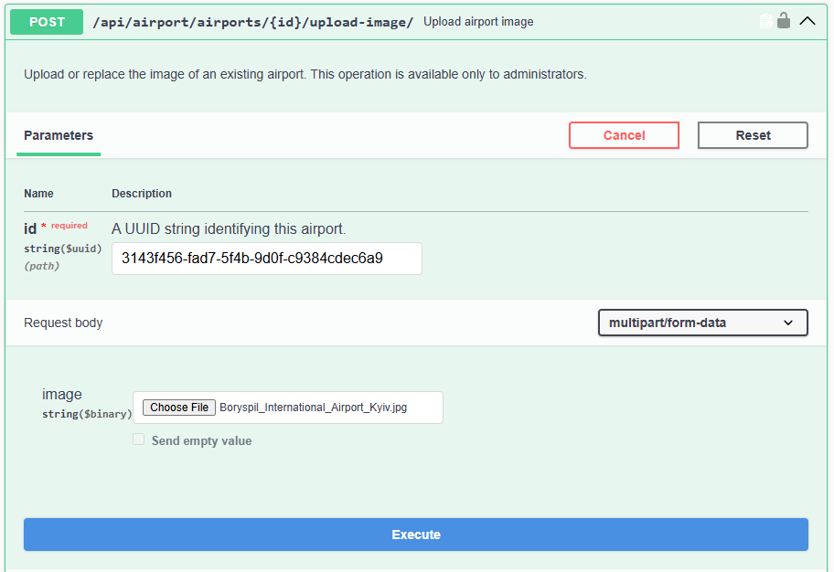</td>
<td>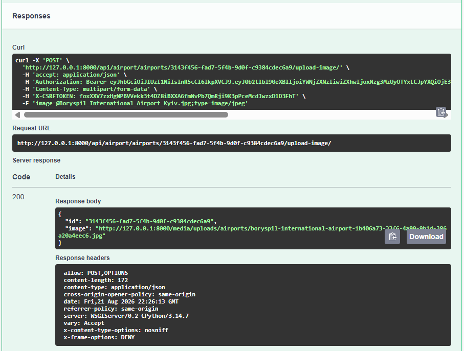</td>
</tr>
<tr>
<td>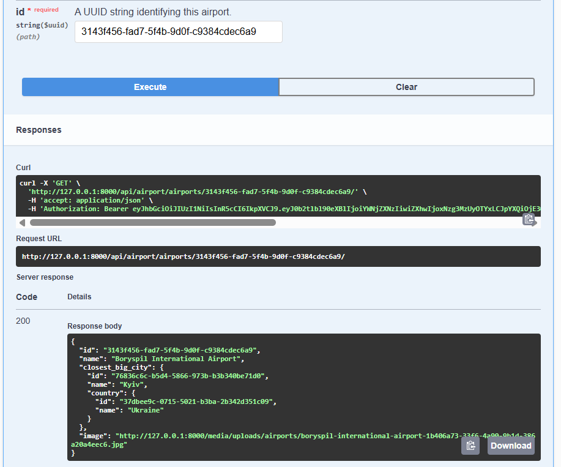</td>
<td>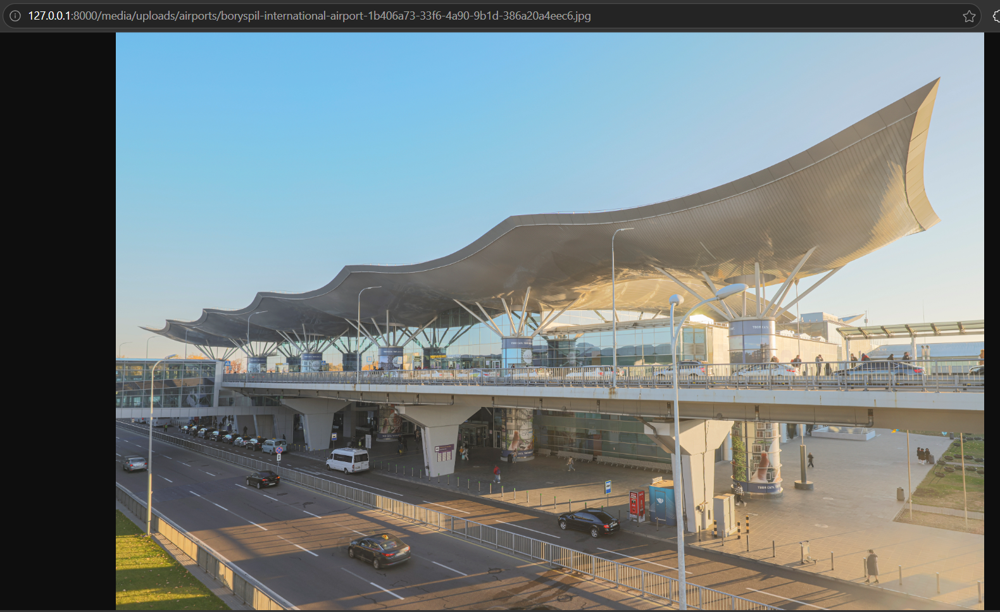</td>
</tr>
</table>


### Possible errors

| Status | Reason |
|---|---|
| `400` | `image` is missing or is not a valid image |
| `401` | User is not authenticated |
| `403` | Authenticated user is not staff |
| `404` | Airport does not exist |

## Statistics response

| Field | Meaning |
|---|---|
| `airport_id` | Airport UUID |
| `airport_name` | Airport name |
| `departing_routes_count` | Distinct routes starting here |
| `arriving_routes_count` | Distinct routes ending here |
| `upcoming_departures_count` | Future non-cancelled departing flights |
| `upcoming_arrivals_count` | Future non-cancelled arriving flights |
| `total_upcoming_flights` | Departures + arrivals |
| `active_tickets_count` | Active tickets on departing flights |
| `cancelled_tickets_count` | Cancelled tickets on departing flights |
| `total_tickets_count` | Active + cancelled tickets |

Example:

```json
{
  "airport_id": "airport-uuid",
  "airport_name": "Boryspil International Airport",
  "departing_routes_count": 5,
  "arriving_routes_count": 4,
  "upcoming_departures_count": 7,
  "upcoming_arrivals_count": 6,
  "total_upcoming_flights": 13,
  "active_tickets_count": 25,
  "cancelled_tickets_count": 3,
  "total_tickets_count": 28
}
```

<p align="center">
  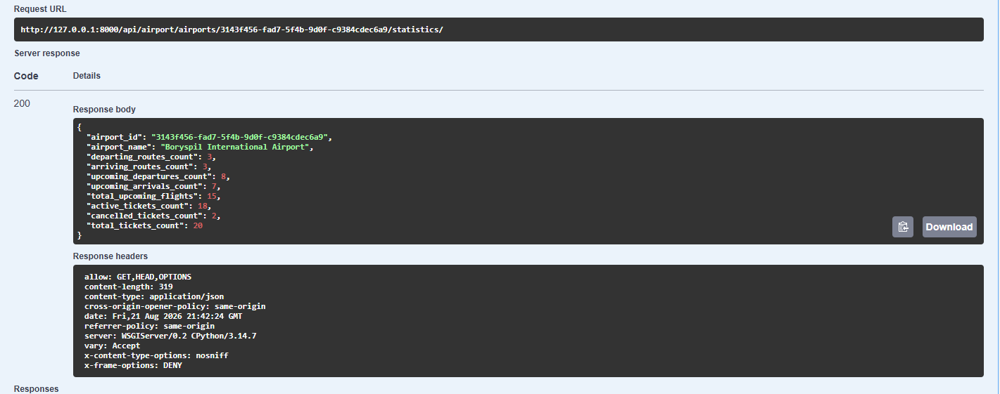
</p>


---

# Airplane types

## Endpoints

| Method | URL | Access |
|---|---|---|
| `GET` | `/api/airport/airplane-types/` | Public |
| `POST` | `/api/airport/airplane-types/` | Staff |
| `GET` | `/api/airport/airplane-types/{id}/` | Public |
| `PUT/PATCH` | `/api/airport/airplane-types/{id}/` | Staff |
| `DELETE` | `/api/airport/airplane-types/{id}/` | Staff |

Schema:

| Field | Type | Rule |
|---|---|---|
| `id` | UUID | Read-only |
| `name` | string | Unique |

---

## Create / update request

```http
POST /api/airport/airplane-types/
Authorization: Bearer <staff-access-token>
Content-Type: application/json
```

```json
{
  "name": "Boeing 737"
}
```

Response:

```json
{
  "id": "airplane-type-uuid",
  "name": "Boeing 737"
}
```

List and detail endpoints use the same object shape.

## Errors

| Status | Why it can happen |
|---|---|
| `400` | Missing/invalid name or duplicate name |
| `401` | Anonymous write request |
| `403` | Authenticated non-staff write |
| `404` | Airplane type ID does not exist |
| `400` | Delete is blocked while protected airplanes reference the type |


---

# Airplanes

## Endpoints

| Method | URL | Access | Purpose |
|---|---|---|---|
| `GET` | `/api/airport/airplanes/` | Public | List |
| `POST` | `/api/airport/airplanes/` | Staff | Create |
| `GET` | `/api/airport/airplanes/{id}/` | Public | Detail |
| `PUT/PATCH` | `/api/airport/airplanes/{id}/` | Staff | Update |
| `DELETE` | `/api/airport/airplanes/{id}/` | Staff | Delete |
| `POST` | `/api/airport/airplanes/{id}/upload-image/` | Staff | Upload image |

## Filters

| Parameter | Matching |
|---|---|
| `airplane_type` | Exact UUID |
| `airplane_type_name` | Case-insensitive contains |
| `name` | Case-insensitive contains |

## Schema

| Field | Type | Rule |
|---|---|---|
| `id` | UUID | Read-only |
| `name` | string | Unique |
| `rows` | integer | Minimum 1 |
| `seats_in_row` | integer | Minimum 1 |
| `airplane_type` | UUID / nested object depending on serializer | Must exist |
| `capacity` | integer | Read-only calculated value |
| `image` | image URL / null | List/detail |

## Create / update request

```json
{
  "name": "UR-001",
  "rows": 20,
  "seats_in_row": 6,
  "airplane_type": "airplane-type-uuid"
}
```

Response:

```json
{
  "id": "airplane-uuid",
  "name": "UR-001",
  "rows": 20,
  "seats_in_row": 6,
  "airplane_type": "airplane-type-uuid",
  "capacity": 120
}
```

## Detail response

```json
{
  "id": "airplane-uuid",
  "name": "UR-001",
  "rows": 20,
  "seats_in_row": 6,
  "airplane_type": {
    "id": "airplane-type-uuid",
    "name": "Boeing 737"
  },
  "capacity": 120,
  "image": null
}
```

Example list item:

```json
{
  "id": "airplane-uuid",
  "name": "UR-001",
  "rows": 20,
  "seats_in_row": 6,
  "airplane_type": "Boeing 737",
  "capacity": 120,
  "image": null
}
```

## Upload airplane image

```http
POST /api/airport/airplanes/{id}/upload-image/
Authorization: Bearer <staff-access-token>
Content-Type: multipart/form-data
```

Request:

| Field | Type | Required |
|---|---|---:|
| `image` | image file | Yes |

Example:

```text
image=<airplane.jpg>
```

Response:

```json
{
  "id": "airplane-uuid",
  "image": "http://127.0.0.1:8000/media/uploads/airplanes/..."
}
```

Errors:

| Status | Reason |
|---|---|
| `400` | Invalid or missing image |
| `401` | Authentication required |
| `403` | Staff permission required |
| `404` | Airplane not found |


---

# Crew

## Endpoints

| Method | URL | Access | Purpose |
|---|---|---|---|
| `GET` | `/api/airport/crew/` | Public | List |
| `POST` | `/api/airport/crew/` | Staff | Create |
| `GET` | `/api/airport/crew/{id}/` | Public | Detail |
| `PUT/PATCH` | `/api/airport/crew/{id}/` | Staff | Update |
| `DELETE` | `/api/airport/crew/{id}/` | Staff | Delete |
| `POST` | `/api/airport/crew/{id}/upload-photo/` | Staff | Upload photo |

## Detail response

```json
{
  "id": "crew-uuid",
  "first_name": "John",
  "last_name": "Smith",
  "photo": null
}
```

## Filters

| Parameter | Matching |
|---|---|
| `first_name` | Case-insensitive contains |
| `last_name` | Case-insensitive contains |
| `flight` | Exact flight UUID |

List item:

```json
{
  "id": "crew-uuid",
  "full_name": "John Smith",
  "photo": null
}
```

Create/update payload:

```json
{
  "first_name": "John",
  "last_name": "Smith"
}
```

## Upload crew photo

```http
POST /api/airport/crew/{id}/upload-photo/
Authorization: Bearer <staff-access-token>
Content-Type: multipart/form-data
```

Request:

| Field | Type | Required |
|---|---|---:|
| `photo` | image file | Yes |

Example:

```text
photo=<crew-member.jpg>
```

Response:

```json
{
  "id": "crew-uuid",
  "photo": "http://127.0.0.1:8000/media/uploads/crews/..."
}
```

Errors:

| Status | Reason |
|---|---|
| `400` | Invalid or missing photo |
| `401` | Authentication required |
| `403` | Staff permission required |
| `404` | Crew member not found |


---

# Routes

## Endpoints

| Method | URL | Access | Purpose |
|---|---|---|---|
| `GET` | `/api/airport/routes/` | Public | List |
| `POST` | `/api/airport/routes/` | Staff | Create |
| `GET` | `/api/airport/routes/{id}/` | Public | Detail |
| `PUT/PATCH` | `/api/airport/routes/{id}/` | Staff | Update |
| `DELETE` | `/api/airport/routes/{id}/` | Staff | Delete |
| `GET` | `/api/airport/routes/popular/` | Public | Popular route ranking |

## Filters

| Parameter | Matching |
|---|---|
| `source` | Source airport UUID |
| `destination` | Destination airport UUID |
| `source_city` | Source city `icontains` |
| `destination_city` | Destination city `icontains` |
| `source_country` | Source country `icontains` |
| `destination_country` | Destination country `icontains` |

Create:

```json
{
  "source": "source-airport-uuid",
  "destination": "destination-airport-uuid",
  "distance": 470
}
```

List response item:

```json
{
  "id": "route-uuid",
  "source_city": "Kyiv",
  "destination_city": "Lviv",
  "source_airport": "Boryspil International Airport",
  "destination_airport": "Lviv International Airport",
  "distance": 470
}
```

## Create response

```json
{
  "id": "route-uuid",
  "source": "source-airport-uuid",
  "destination": "destination-airport-uuid",
  "distance": 470
}
```

## Detail response

The detail representation expands both airports, including their city and
country data:

```json
{
  "id": "route-uuid",
  "source": {
    "id": "source-airport-uuid",
    "name": "Boryspil International Airport",
    "closest_big_city": {
      "id": "city-uuid",
      "name": "Kyiv",
      "country": {
        "id": "country-uuid",
        "name": "Ukraine"
      }
    },
    "image": null
  },
  "destination": {
    "id": "destination-airport-uuid",
    "name": "Lviv International Airport",
    "closest_big_city": {
      "id": "city-uuid",
      "name": "Lviv",
      "country": {
        "id": "country-uuid",
        "name": "Ukraine"
      }
    },
    "image": null
  },
  "distance": 470
}
```

## Popular routes

```http
GET /api/airport/routes/popular/?limit=5
```

This endpoint answers a different question from the normal route list: it shows
which routes have the strongest **actual booking activity**.

A route is treated as more popular when passengers have more active tickets on
its non-cancelled flights. `tickets_count` therefore represents booking demand,
while `flights_count` shows how many non-cancelled flights currently contribute
to that route's operational activity.

| Field | Meaning |
|---|---|
| `route_id` | Route UUID |
| `route_cities` | Readable source and destination city pair |
| `route_airports` | Readable source and destination airport pair |
| `flights_count` | Number of non-cancelled flights for the route |
| `tickets_count` | Number of active tickets belonging to non-cancelled flights on the route |

In other words, the endpoint does **not** decide popularity from route distance,
airport name, or the number of times a route record exists. It derives the
ranking from real flight/booking data associated with each route. Cancelled
flights and cancelled tickets do not increase booking popularity.

`limit` controls how many of the highest-ranked routes are returned:

```http
GET /api/airport/routes/popular/?limit=3
```

Response:

```json
[
  {
    "route_id": "route-uuid",
    "route_cities": "Kyiv → Lviv",
    "route_airports": "Boryspil International Airport → Lviv International Airport",
    "flights_count": 12,
    "tickets_count": 30
  }
]
```

`limit` must be a positive number.

<p align="center">
  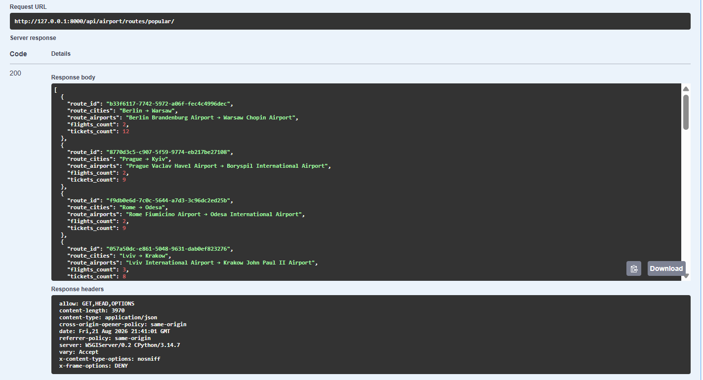
</p>

## Route errors

| Status | Field | Condition |
|---|---|---|
| `400` | `destination` | Source and destination are the same airport |
| `400` | source/destination | Invalid airport IDs or duplicate route data |
| `401` | — | Anonymous write |
| `403` | — | Non-staff write |
| `404` | — | Route ID does not exist |

The same-source/destination rule returns:

```json
{
  "destination": [
    "Destination must differ from source."
  ]
}
```


---

# Flights

## Endpoints

| Method | URL | Access | Serializer / behavior |
|---|---|---|---|
| `GET` | `/api/airport/flights/` | Public | `FlightListSerializer` |
| `POST` | `/api/airport/flights/` | Staff | `FlightSerializer` |
| `GET` | `/api/airport/flights/{id}/` | Public | `FlightDetailSerializer` |
| `PUT/PATCH` | `/api/airport/flights/{id}/` | Staff | `FlightSerializer` |
| `DELETE` | `/api/airport/flights/{id}/` | Staff | Delete |
| `POST` | `/api/airport/flights/{id}/cancel/` | Staff | Dedicated cancellation |

## Filters

<table>
<tr><th>Parameter</th><th>Type</th><th>Meaning</th></tr>
<tr><td><code>source</code></td><td>UUID</td><td>Source airport</td></tr>
<tr><td><code>destination</code></td><td>UUID</td><td>Destination airport</td></tr>
<tr><td><code>source_city</code></td><td>string</td><td>Source city contains</td></tr>
<tr><td><code>destination_city</code></td><td>string</td><td>Destination city contains</td></tr>
<tr><td><code>departure_time</code></td><td>datetime</td><td>Exact departure</td></tr>
<tr><td><code>departure_time_range_after</code></td><td>ISO datetime</td><td>Departure lower bound</td></tr>
<tr><td><code>departure_time_range_before</code></td><td>ISO datetime</td><td>Departure upper bound</td></tr>
<tr><td><code>arrival_time</code></td><td>datetime</td><td>Exact arrival</td></tr>
<tr><td><code>arrival_time_range_after</code></td><td>ISO datetime</td><td>Arrival lower bound</td></tr>
<tr><td><code>arrival_time_range_before</code></td><td>ISO datetime</td><td>Arrival upper bound</td></tr>
<tr><td><code>airplane</code></td><td>UUID</td><td>Exact airplane</td></tr>
<tr><td><code>airplane_name</code></td><td>string</td><td>Airplane name contains</td></tr>
<tr><td><code>crew</code></td><td>UUID(s)</td><td>Crew member IDs</td></tr>
<tr><td><code>crew_last_names</code></td><td>CSV string</td><td>Any supplied last name</td></tr>
<tr><td><code>crew_all_last_names</code></td><td>CSV string</td><td>All supplied last names</td></tr>
<tr><td><code>has_available_seats</code></td><td>boolean</td><td>Only flights with / without seats</td></tr>
</table>

Example:

```http
GET /api/airport/flights/?source_city=kyiv&has_available_seats=true
```

## Create flight

```json
{
  "route": "route-uuid",
  "airplane": "airplane-uuid",
  "departure_time": "2026-09-10T10:00:00Z",
  "arrival_time": "2026-09-10T12:00:00Z",
  "status": "scheduled",
  "crew": [
    "crew-uuid"
  ]
}
```

## Create response

```json
{
  "id": "flight-uuid",
  "route": "route-uuid",
  "airplane": "airplane-uuid",
  "departure_time": "2026-09-10T10:00:00Z",
  "arrival_time": "2026-09-10T12:00:00Z",
  "status": "scheduled",
  "crew": [
    "crew-uuid"
  ]
}
```

Validation includes:

| Check | Result when invalid |
|---|---|
| Arrival <= departure | `400` on `arrival_time` |
| Empty crew | `400` on `crew` |
| Busy crew | `400` on `crew` |
| Busy airplane | `400` on `airplane` |
| Direct `cancelled` status | `400` on `status` |
| Change airplane with active tickets | `400` on `airplane` |

## List response

<p align="center">
  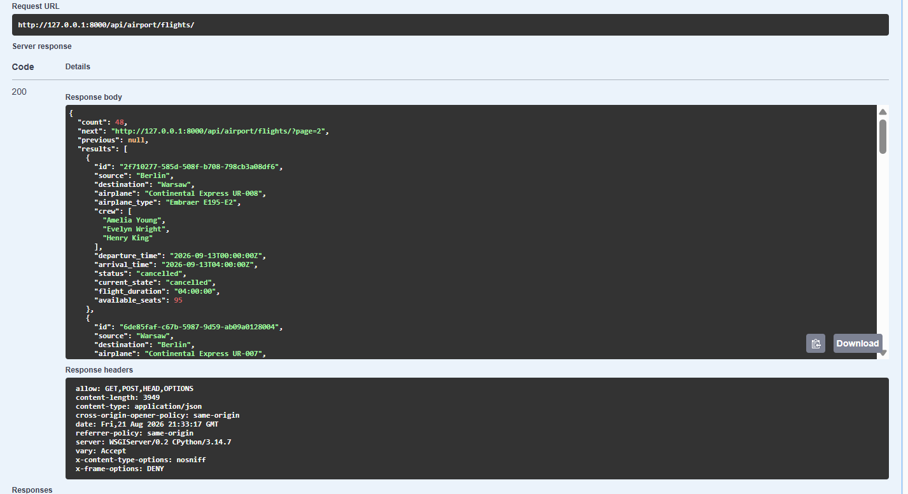
</p>


```json
{
  "id": "flight-uuid",
  "source": "Kyiv",
  "destination": "Lviv",
  "airplane": "UR-001",
  "airplane_type": "Boeing 737",
  "crew": [
    "John Smith"
  ],
  "departure_time": "2026-09-10T10:00:00Z",
  "arrival_time": "2026-09-10T12:00:00Z",
  "status": "scheduled",
  "current_state": "scheduled",
  "flight_duration": "02:00:00",
  "available_seats": 119
}
```

## Flight detail response

`GET /api/airport/flights/{id}/` uses `FlightDetailSerializer`.

Unlike the compact list representation, detail expands the main related
resources.

### Response structure

| Field | Representation | Meaning |
|---|---|---|
| `id` | UUID | Flight identifier |
| `route` | nested object | Full route with source/destination airport details |
| `airplane` | nested object | Airplane details including airplane type and image |
| `departure_time` | datetime | Planned departure |
| `arrival_time` | datetime | Planned arrival |
| `status` | string | Stored business status |
| `current_state` | string | Calculated state based on status and current time |
| `flight_duration` | duration | Arrival minus departure |
| `crew` | array | Crew members with IDs and names |
| `taken_seats` | array | Only seats reserved by active tickets |

Example:

```json
{
  "id": "flight-uuid",
  "route": {
    "id": "route-uuid",
    "source": {
      "id": "airport-uuid",
      "name": "Boryspil International Airport",
      "closest_big_city": {
        "id": "city-uuid",
        "name": "Kyiv",
        "country": {
          "id": "country-uuid",
          "name": "Ukraine"
        }
      },
      "image": null
    },
    "destination": {
      "id": "airport-uuid",
      "name": "Lviv International Airport",
      "closest_big_city": {
        "id": "city-uuid",
        "name": "Lviv",
        "country": {
          "id": "country-uuid",
          "name": "Ukraine"
        }
      },
      "image": null
    },
    "distance": 470
  },
  "airplane": {
    "id": "airplane-uuid",
    "name": "UR-001",
    "rows": 20,
    "seats_in_row": 6,
    "airplane_type": {
      "id": "airplane-type-uuid",
      "name": "Boeing 737"
    },
    "capacity": 120,
    "image": null
  },
  "departure_time": "2026-09-10T10:00:00Z",
  "arrival_time": "2026-09-10T12:00:00Z",
  "status": "scheduled",
  "current_state": "scheduled",
  "flight_duration": "02:00:00",
  "crew": [
    {
      "id": "crew-uuid",
      "first_name": "John",
      "last_name": "Smith"
    }
  ],
  "taken_seats": [
    {
      "row": 1,
      "seat": 1
    },
    {
      "row": 1,
      "seat": 2
    }
  ]
}
```

`taken_seats` deliberately contains only active tickets. Cancelled tickets stay
in booking history but no longer occupy the seat.

### Flight detail in Swagger

<table>
<tr>
<td>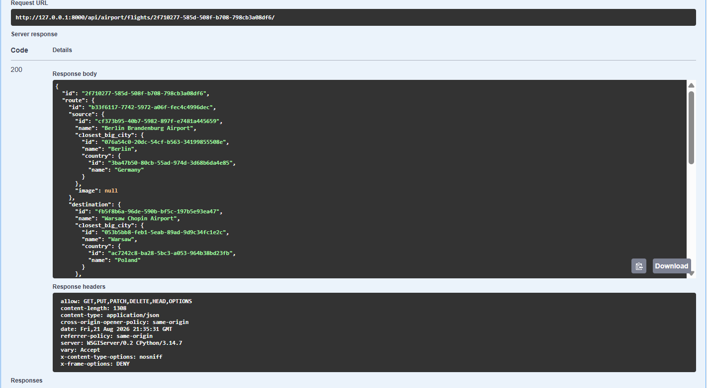</td>
<td>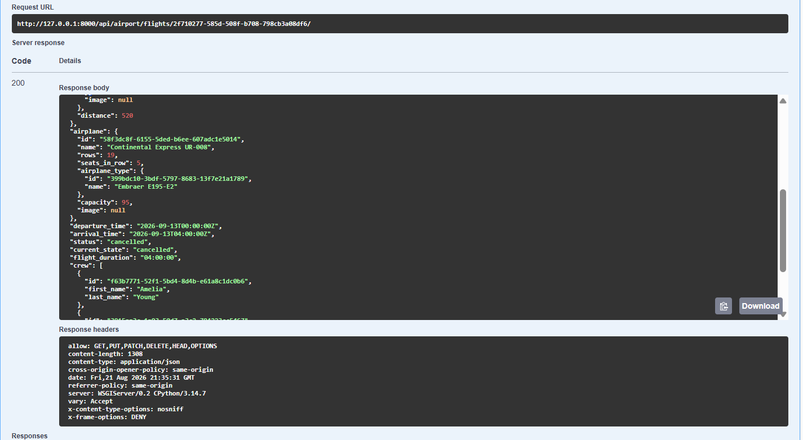</td>
</tr>
<tr>
<td colspan="2" align="center">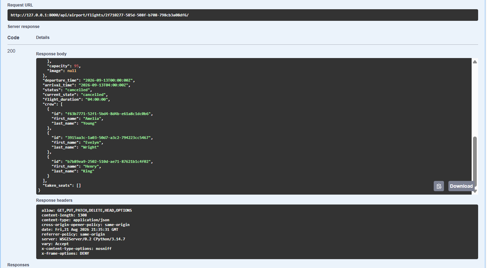</td>
</tr>
</table>

The active-seat part of the response is shown separately below because it is an
important booking-specific representation:

<p align="center">
  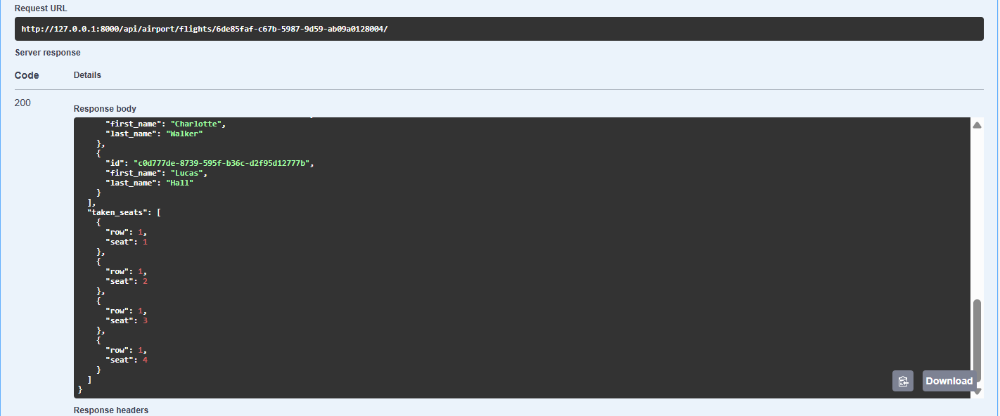
</p>

## Cancel flight

```http
POST /api/airport/flights/{id}/cancel/
Authorization: Bearer <staff-access-token>
```

Response:

```json
{
  "id": "flight-uuid",
  "status": "cancelled"
}
```

Cancellation is rejected when the flight:

- is already cancelled;
- has already departed.

### Cancellation example

<table>
<tr>
<td>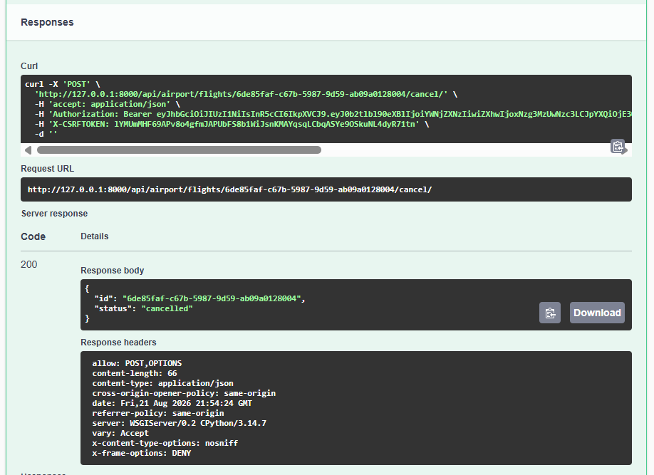</td>
<td>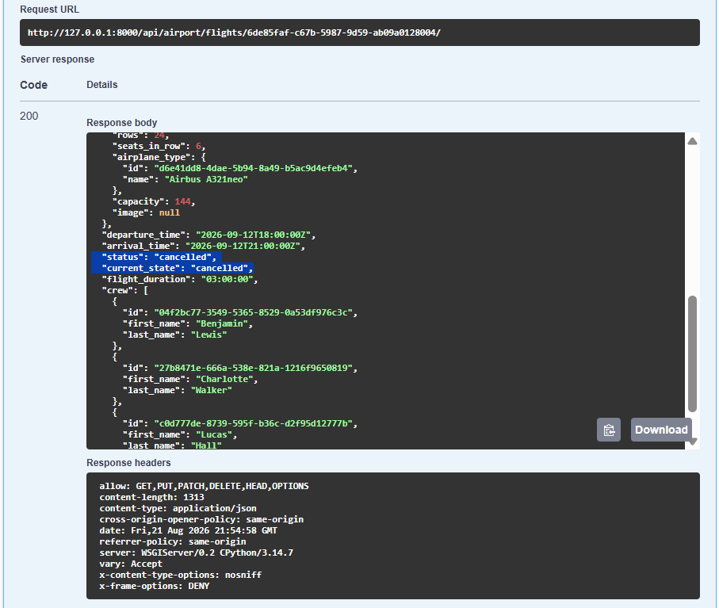</td>
</tr>
</table>

A flight cancellation also demonstrates the lifecycle propagation to related
booking data:

<table>
<tr>
<td><b>Before flight cancellation</b><br>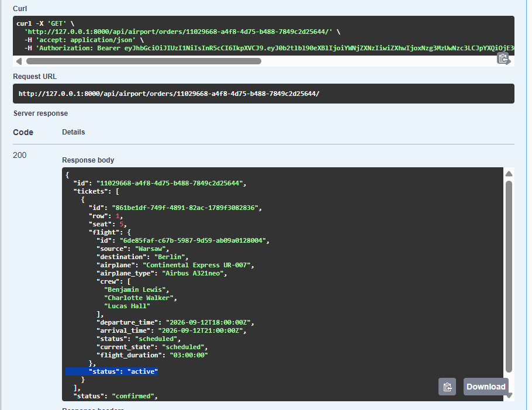</td>
<td><b>After flight cancellation</b><br>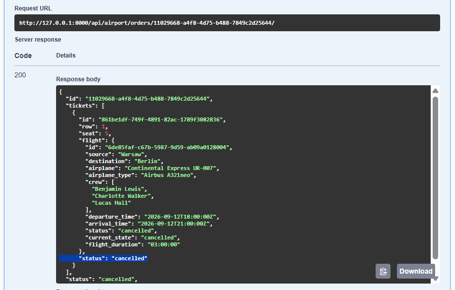</td>
</tr>
</table>

## Flight errors

| Status | Field | Why it occurs |
|---|---|---|
| `400` | `arrival_time` | Arrival is not later than departure |
| `400` | `crew` | Crew list is empty |
| `400` | `crew` | One or more crew members conflict with another flight/buffer |
| `400` | `airplane` | Airplane conflicts with another flight/buffer |
| `400` | `airplane` | Attempt to change airplane after active tickets exist |
| `400` | `status` | Direct attempt to set `cancelled` |
| `400` | `status` | Cancellation endpoint called for an already-cancelled flight |
| `400` | `status` | Cancellation attempted after departure |
| `401` | — | Authentication required for write |
| `403` | — | Staff permission required |
| `404` | — | Flight does not exist |

Examples:

```json
{
  "status": [
    "A cancelled flight cannot be modified."
  ]
}
```

```json
{
  "airplane": [
    "The airplane cannot be changed because active tickets already exist for this flight."
  ]
}
```

```json
{
  "status": [
    "Flight is already cancelled."
  ]
}
```

```json
{
  "status": [
    "A flight cannot be cancelled after departure."
  ]
}
```


---

# Orders

Orders require authentication.

## Supported operations

| Method | URL | Regular user | Staff |
|---|---|---:|---:|
| `GET` | `/api/airport/orders/` | Own orders | All orders |
| `POST` | `/api/airport/orders/` | Yes | Yes |
| `GET` | `/api/airport/orders/{id}/` | Own only | Any |
| `POST` | `/api/airport/orders/{id}/cancel/` | Own only | Any |
| `PUT/PATCH/DELETE` | `/api/airport/orders/{id}/` | Not exposed | Not exposed |

## Create order

```http
POST /api/airport/orders/
Authorization: Bearer <access-token>
Content-Type: application/json
```

Payload:

```json
{
  "tickets": [
    {
      "flight": "flight-uuid",
      "row": 1,
      "seat": 1
    },
    {
      "flight": "flight-uuid",
      "row": 1,
      "seat": 2
    }
  ]
}
```

### Create order in Swagger

<table>
<tr>
<td>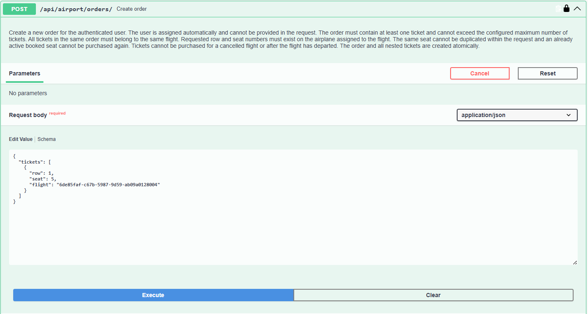</td>
<td>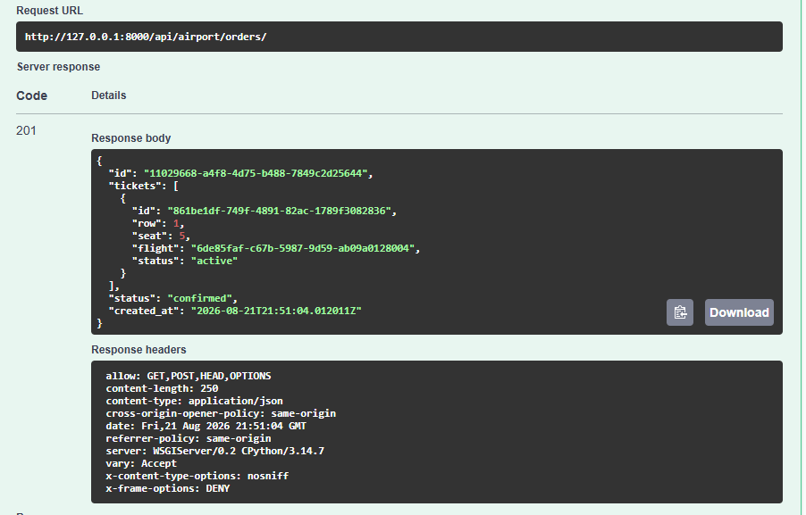</td>
</tr>
</table>

## Create response

```json
{
  "id": "order-uuid",
  "tickets": [
    {
      "id": "ticket-uuid",
      "row": 1,
      "seat": 1,
      "flight": "flight-uuid",
      "status": "active"
    }
  ],
  "status": "confirmed",
  "created_at": "2026-09-01T10:00:00Z"
}
```

## Order creation rules

| Rule | Validation |
|---|---|
| Tickets must be present | Empty list rejected |
| Maximum tickets | Controlled by `MAX_TICKETS_PER_ORDER` |
| Same flight | All tickets in one order must reference one flight |
| Seat coordinates | Must fit airplane layout |
| Duplicate seat in request | Rejected before database write |
| Existing active seat | Rejected |
| Cancelled flight | Rejected |
| Departed flight | Rejected |
| Creation consistency | Order + tickets created atomically |

The user is always taken from:

```python
request.user
```

The client cannot create an order on behalf of another user.

## List response

```json
{
  "id": "order-uuid",
  "tickets_count": 2,
  "status": "confirmed",
  "created_at": "2026-09-01T10:00:00Z"
}
```

## Detail response

Order detail expands every ticket and, inside each ticket, expands `flight` using
the flight list representation. This gives the client enough flight context
without requiring a separate request for every ticket.

```json
{
  "id": "order-uuid",
  "tickets": [
    {
      "id": "ticket-uuid",
      "row": 1,
      "seat": 5,
      "flight": {
        "id": "flight-uuid",
        "source": "Warsaw",
        "destination": "Berlin",
        "airplane": "Continental Express UR-007",
        "airplane_type": "Airbus A321neo",
        "crew": [
          "Benjamin Lewis",
          "Charlotte Walker",
          "Lucas Hall"
        ],
        "departure_time": "2026-09-12T18:00:00Z",
        "arrival_time": "2026-09-12T21:00:00Z",
        "status": "scheduled",
        "current_state": "scheduled",
        "flight_duration": "03:00:00"
      },
      "status": "active"
    }
  ],
  "status": "confirmed",
  "created_at": "2026-08-21T21:51:04.012011Z"
}
```

The nested flight contains both:

- `status` — the persisted business status;
- `current_state` — the state calculated from time and stored status.

It also includes the airplane type, assigned crew, departure/arrival times and
calculated flight duration, matching the actual order-detail response.

<p align="center">
  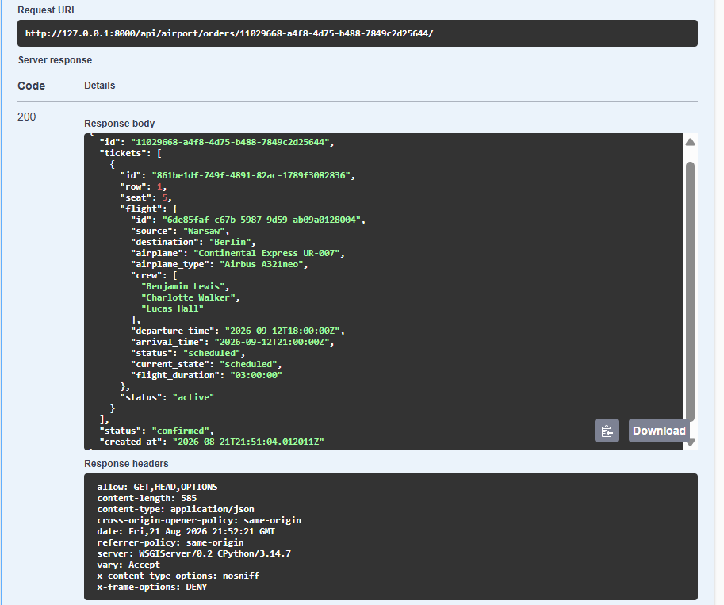
</p>

## Cancel order

```http
POST /api/airport/orders/{id}/cancel/
Authorization: Bearer <access-token>
```

Response:

```json
{
  "id": "order-uuid",
  "status": "cancelled"
}
```

Cancellation is rejected if the order is already cancelled or if cancellation is no longer valid because an active non-cancelled flight has departed.

## Order errors

| Status | Field | Condition |
|---|---|---|
| `400` | `tickets` | Empty ticket list |
| `400` | `tickets` | Ticket count exceeds `MAX_TICKETS_PER_ORDER` |
| `400` | `tickets` | Tickets belong to different flights |
| `400` | `tickets` | Same seat appears twice in one request |
| `400` | `tickets` | Active seat is already booked |
| `400` | nested ticket field | Row/seat is outside airplane layout |
| `400` | `flight` | Flight is cancelled |
| `400` | `flight` | Flight has departed |
| `400` | `detail` | Order is already cancelled |
| `400` | `detail` | Cancellation attempted after relevant flight departure |
| `401` | — | User is not authenticated |
| `404` | — | Order does not exist or belongs to another passenger |

Important messages include:

```json
{
  "tickets": [
    "All tickets in an order must belong to the same flight."
  ]
}
```

```json
{
  "tickets": [
    "Seat 1-1 is already booked for this flight."
  ]
}
```

```json
{
  "detail": [
    "Order cannot be cancelled after flight departure."
  ]
}
```


---

# Tickets

There is intentionally no standalone ticket ViewSet.

Tickets are created inside an order so the API can validate the complete booking
before anything is committed. The booking operation can therefore validate the
flight, all requested seat coordinates, duplicate seats, existing active
reservations and the order-wide ticket rules as one unit.

## Ticket schema

| Field | Type | Read-only | Notes |
|---|---|---:|---|
| `id` | UUID | Yes | Generated automatically |
| `flight` | UUID on input / nested flight in order detail | No | Required during order creation |
| `row` | integer | No | Must exist on the selected airplane |
| `seat` | integer | No | Must exist within the selected row |
| `status` | `active` / `cancelled` | Yes | Managed by booking and cancellation lifecycle operations |

## Input representation

A ticket is supplied as part of an order request:

```json
{
  "flight": "flight-uuid",
  "row": 1,
  "seat": 2
}
```

The client does not provide `id` or `status`.

## Response representation after order creation

Immediately after creation, the ticket uses the write-oriented representation,
so `flight` is represented by its UUID:

```json
{
  "id": "ticket-uuid",
  "row": 1,
  "seat": 2,
  "flight": "flight-uuid",
  "status": "active"
}
```

## Response representation inside order detail

When an order is retrieved through:

```http
GET /api/airport/orders/{id}/
```

the ticket is represented by the read serializer and `flight` is expanded using
the flight list representation:

```json
{
  "id": "ticket-uuid",
  "row": 1,
  "seat": 5,
  "flight": {
    "id": "flight-uuid",
    "source": "Warsaw",
    "destination": "Berlin",
    "airplane": "Continental Express UR-007",
    "airplane_type": "Airbus A321neo",
    "crew": [
      "Benjamin Lewis",
      "Charlotte Walker",
      "Lucas Hall"
    ],
    "departure_time": "2026-09-12T18:00:00Z",
    "arrival_time": "2026-09-12T21:00:00Z",
    "status": "scheduled",
    "current_state": "scheduled",
    "flight_duration": "03:00:00"
  },
  "status": "active"
}
```

This difference is intentional: order creation accepts compact identifiers,
while order detail returns richer flight context for already-created tickets.

---

# User API examples

## Register

```http
POST /api/user/register/
```

```json
{
  "email": "passenger@example.com",
  "password": "strong-password"
}
```

Response:

```json
{
  "id": 1,
  "email": "passenger@example.com",
  "is_staff": false
}
```

## Obtain JWT

```http
POST /api/user/token/
```

```json
{
  "email": "passenger@example.com",
  "password": "strong-password"
}
```

Response:

```json
{
  "refresh": "<refresh-token>",
  "access": "<access-token>"
}
```

## Refresh

```http
POST /api/user/token/refresh/
```

```json
{
  "refresh": "<refresh-token>"
}
```

## Verify

```http
POST /api/user/token/verify/
```

```json
{
  "token": "<token>"
}
```

## Current user

```http
GET /api/user/me/
Authorization: Bearer <access-token>
```

`is_staff` is read-only and cannot be used for self-promotion.

---

## User API errors

| Status | Why it can happen |
|---|---|
| `400` | Registration/profile data is invalid or email is already used |
| `401` | `/me/` is requested without a valid access token |
| `400/401` | JWT credentials/token are invalid or expired, depending on the SimpleJWT endpoint |


---

# OpenAPI documentation

| Documentation | URL |
|---|---|
| Swagger UI | `http://127.0.0.1:8000/api/docs/` |
| ReDoc | `http://127.0.0.1:8000/api/docs/redoc/` |
| OpenAPI schema | `http://127.0.0.1:8000/api/doc/` |

Swagger can be used to inspect:

- path parameters;
- query filters;
- request schemas;
- response schemas;
- JWT-authenticated operations;
- custom actions.

<p align="center">
  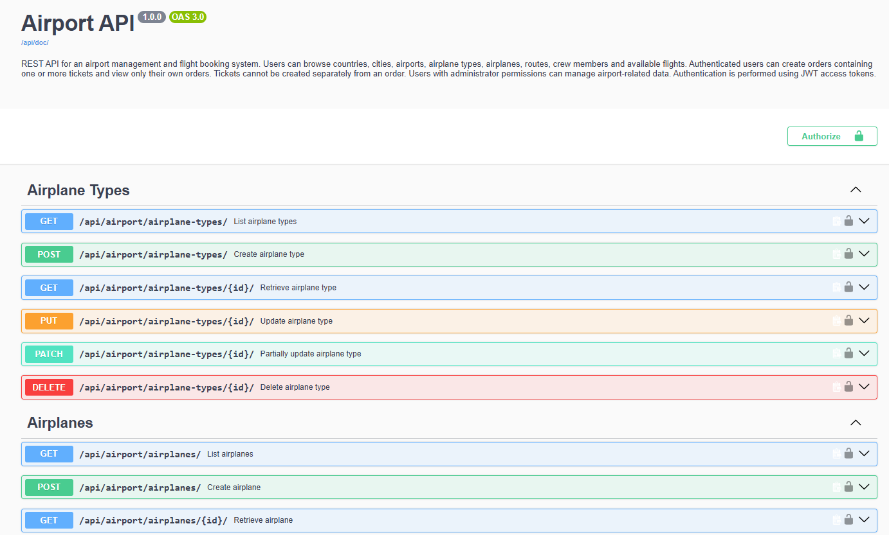
</p>


---

# Testing

The project uses Django's test framework for isolated application tests and
`coverage.py` for statement coverage. The suite is organized by application
layer so a failure points directly to the area that owns the behavior.

## Run the current complete suite

Locally:

```bash
uv run python manage.py test
```

Inside Docker:

```bash
docker compose exec app python manage.py test
```

Both commands discover the current test suite automatically and print the actual
up-to-date number of tests for that revision.

## Test structure

```text
airport/tests/
├── admin/
│   ├── __init__.py
│   ├── test_admin.py
│   └── test_admin_forms.py
├── models/
│   ├── __init__.py
│   ├── test_flight_model.py
│   ├── test_order_model.py
│   ├── test_reference_models.py
│   ├── test_route_model.py
│   └── test_ticket_model.py
├── serializers/
│   ├── __init__.py
│   ├── test_flight_serializers.py
│   ├── test_order_serializers.py
│   ├── test_reference_serializers.py
│   ├── test_route_serializers.py
│   └── test_ticket_serializers.py
├── validation/
│   ├── __init__.py
│   ├── test_flight_validators.py
│   ├── test_order_validators.py
│   ├── test_route_validators.py
│   └── test_ticket_validators.py
├── views/
│   ├── __init__.py
│   ├── test_airplane_type_views.py
│   ├── test_airplane_views.py
│   ├── test_airport_views.py
│   ├── test_city_views.py
│   ├── test_country_views.py
│   ├── test_crew_views.py
│   ├── test_flight_views.py
│   ├── test_order_views.py
│   └── test_route_views.py
├── __init__.py
└── base.py

user/tests/
├── __init__.py
├── test_admin.py
├── test_managers.py
├── test_serializers.py
└── test_views.py
```

`airport/tests/base.py` contains reusable setup for scheduling-heavy scenarios so
serializer, validator and admin tests do not have to duplicate the same country,
city, airport, route, airplane, crew and flight graph.

## What is tested

| Layer | Examples |
|---|---|
| Models | Properties, `__str__`, defaults, model validation and constraints |
| Validators | Flight times, crew presence, schedule conflicts, 30-minute buffers, ticket bounds and cancellation rules |
| Serializers | Input validation, nested output, read-only fields, booking rules and atomic order creation |
| Views | CRUD, permissions, pagination, filters, image uploads, statistics and custom actions |
| Airport admin | Display helpers, optimized querysets, foreign-key form fields, inline behavior and flight lifecycle restrictions |
| Admin forms | Allowed flight status changes and protection against direct cancellation through the admin form |
| User admin | Custom email-based admin configuration and admin pages without `username` |
| User/JWT | User manager, password hashing, registration, current-user operations and token workflows |

## Access-level testing

| Client | What is verified |
|---|---|
| Anonymous | Public reads and rejected protected writes |
| Authenticated passenger | Public data, own bookings and ownership isolation |
| Staff | Reference management, uploads, scheduling and staff-only actions |
| Administrator | Django Admin access and custom airport/user admin behavior |

## Important edge cases

The suite includes boundary and business scenarios such as:

- first and last valid airplane row/seat;
- invalid row and seat boundaries;
- delayed and cancelled flights;
- airplane and crew schedule conflicts;
- exact 30-minute buffer boundaries;
- cancelled flights excluded from schedule conflicts;
- current flight excluded during update validation;
- duplicate seats within one request;
- already-booked active seats;
- cancelled-ticket seat reuse;
- orders containing tickets from different flights;
- configurable maximum ticket limit;
- flight and order cancellation propagation;
- order ownership restrictions;
- invalid filters;
- popular-route results;
- airport statistics;
- multipart image/photo validation;
- custom admin display/queryset behavior;
- flight admin lifecycle restrictions;
- custom email-based user admin behavior.

## Coverage

Coverage is measured only for the configured application source. Tests,
migrations, management commands, `admin_filters.py`, app boilerplate and package
`__init__.py` files are intentionally excluded by `.coveragerc`.

```ini
[run]
source =
    airport
    user

omit =
    */tests/*
    */migrations/*
    */airport/management/*
    */admin_filters.py
    */apps.py
    */__init__.py

[report]
show_missing = True
skip_covered = True
```

`admin.py` is intentionally **not** excluded: project-specific airport and user
admin behavior is covered by the test suite.

### Local coverage commands

```bash
uv run coverage erase
uv run coverage run manage.py test
uv run coverage report -m
uv run coverage html
```

### Coverage inside Docker

```bash
docker compose exec app coverage erase
docker compose exec app coverage run manage.py test
docker compose exec app coverage report -m
```

Generate the HTML report inside the application container:

```bash
docker compose exec app coverage html -d /coverage/htmlcov
```

Copy it to the host only when you want to open the generated HTML report in your
normal browser:

```bash
docker cp airport-api-app-1:/coverage/htmlcov ./htmlcov
```

Then open:

```text
htmlcov/index.html
```

### Coverage screenshots

<p align="center">
  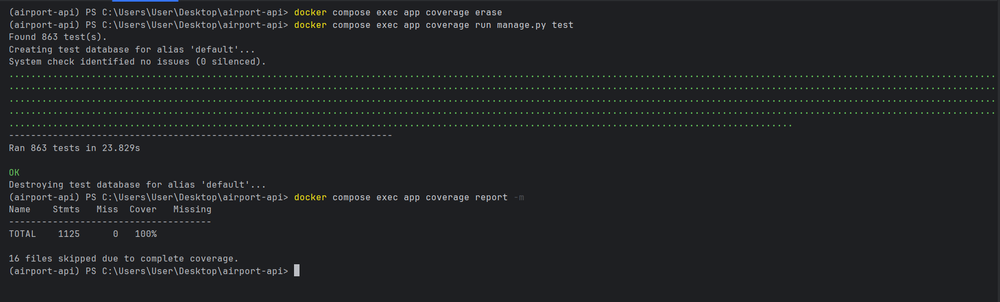
</p>

<p align="center">
  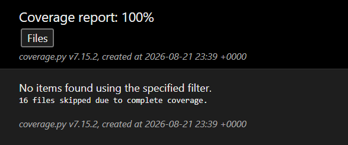
</p>

---

# Code quality

| Tool | Command | Purpose |
|---|---|---|
| Flake8 | `uv run flake8` | Style and static analysis |
| Black | `uv run black .` | Formatting |
| Django tests | `uv run python manage.py test` | Functional verification |
| Coverage | `uv run coverage report -m` | Coverage report |

`pytest.ini`:

```ini
[pytest]
DJANGO_SETTINGS_MODULE = airport_service.settings
```

---

# Development workflow

The project uses `develop` as the integration branch.

```text
main
  |
  └── develop
      ├── feature/...
      ├── fix/...
      ├── test/...
      ├── refactor/...
      ├── style/...
      └── chore/...
```

## Commit convention

| Prefix | Purpose |
|---|---|
| `feat:` | New functionality |
| `fix:` | Bug fix |
| `test:` | Tests |
| `refactor:` | Internal restructuring |
| `style:` | Non-functional style fixes |
| `docs:` | Documentation |
| `chore:` | Maintenance/configuration |
| `merge:` | Explicit integration commit |

A commit message contains:

```text
Short imperative subject

Detailed explanatory body describing what changed and why.
```

---

# Author

**Sabina Gamidova**

Backend Developer

- GitHub: [@otakuc0der](https://github.com/otakuc0der)
- Email: [sabina.gamidova.dev@gmail.com](mailto:sabina.gamidova.dev@gmail.com)
